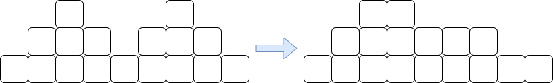
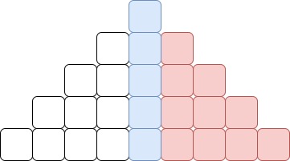

# A. Invitados De Fiesta

El problema plantea la necesidad de seleccionar los candidatos adecuados de una lista original de números, evitando aquellos que se encuentran en una lista de números prohibidos.

Una opción es implementar un algoritmo de fuerza bruta, donde por cada elemento de la lista original se recorre la otra lista para verificar si está presente o no. Sin embargo, esta solución tiene una complejidad de $O(N * M)$, lo cual solo es útil para conjuntos de casos donde $N, M ≤ 10^4$.

Otra posibilidad es intentar utilizar una estructura de cubeta o arreglo. Sin embargo, los límites de los números en la lista son muy grandes, lo que hace que esta opción no sea viable. La cubeta solo sería eficiente cuando $a_i \leq 10^6$ debido a restricciones de memoria.

La **solución esperada** era utilizar una estructura de datos proporcionada por una librería estándar, como `map`, `set`, `unordered_set` o `unordered_map`. Cualquiera de estas estructuras brindaba una solución aceptable. Se debían agregar los elementos a uno de estos contenedores y utilizar sus funciones para verificar si un elemento se encontraba o no. El uso de map o set era suficiente, ya que brindaban una complejidad de $O(N log M)$. Sin embargo, utilizar las estructuras sin orden también era una opción válida, ya que agilizaba el código debido a algunas constantes.

```cpp
#include <bits/stdc++.h>
using namespace std;

int N, M, K;

int main() {
    ios_base::sync_with_stdio(0);
    cin.tie(0);

    cin >> N >> M >> K;
    
    vector<int> nums(N);
    set<int> blacklist;
    
    for (auto& it : nums) cin >> it;
    for (int i = 0; i < M; i++) {
        int a; cin >> a;
        blacklist.insert(a);
    } 

    if (N == M) {
        cout << "-1";
        return 0;
    }

    int sz = 0;
    
    for(auto& it : nums) {
        // Preguntamos si el elemento se encuentra en el set o no.
        if (!blacklist.count(it)) {
            cout << it << ' ';
            sz++;
        }
        if (sz == K) break;
    }

    return 0;
}
```

*Otras soluciones posibles* incluían el uso de un `pair` (número, posición) y el ordenamiento de los números para implementar una solución basada en dos punteros. Esta solución podría intuirse al considerar los casos en los que las listas estaban ordenadas. Si las listas están ordenadas, solo se necesita llevar un puntero a la posición inferior, que indica el siguiente número por el cual se debe verificar. Esta solución tendría una complejidad de $O(N log N)$ debido al ordenamiento. Además, como se guarda la posición en la preja, se puede ordenar nuevamente para obtener la solución deseada.

Otra opción era darse cuenta de que la lista de números no deseados en realidad no importaba su orden. Por lo tanto, se podía ordenar esta lista y realizar una búsqueda binaria para cada número y verificar si se encontraba en la lista o no. Esto tendría una complejidad de $O(N log M)$.

# B. Concurso de Cartas

La observación importante en este problema era darse cuenta de que, *siempre que fuera posible*, era conveniente tomar cartas de mayor valor. En última instancia, cualquier solución se podía ver como una "montaña" que sube y luego baja. En caso de que no sea así, siempre se puede ordenar la lista para que tenga esa estructura.



Entonces, si queremos lograr una configuración óptima, debemos intentar siempre tomar el valor más alto posible, lo cual se logra subiendo el valor siempre que sea posible. La pregunta que queda por resolver es: ¿cómo determinamos si un valor es factible o no?



Cuando tomamos una carta de valor $a_i$, debemos tener en cuenta que **lo mínimo que tendremos que hacer** es tomar todas las cartas desde 1 hasta $a_i$. Por lo tanto, podemos calcular ese valor y compararlo con el valor de $N$ para determinar si, al tomar esta carta, estamos destinados a exceder el valor de $N$. De manera más concreta, si llamamos $S$ a la suma de los valores que llevamos y $a_i$ es el nuevo valor que vamos a poner, debemos verificar que:

$$
S + (1 + 2 + 3 + ... + a_i) \leq N
$$

En caso de que esta condición no se cumpla, no podemos tomar ese valor. Por lo tanto, intentamos subir el valor de nuestra carta en primer lugar. En caso de que veamos que no es posible, intentamos igualarlo. Y si aún no es posible, bajamos el valor. Al bajar el valor de la carta, siempre se podrá alcanzar el numero deseado debido a las condiciones que hemos estado revisando en cada movimiento. Utilizamos la fórmula de la Suma de Gauss para hacerlo eficiente, y nuestra complejidad se vuelve simplemente $O(S)$, donde $S$ es el tamaño de la salida, que se asegura que no superará los $10^6$.

Como nota rápida, recuerda verificar al subir de carta que no te estás excediendo del valor máximo permitido.

```cpp
#include <bits/stdc++.h>
using namespace std;

long long gauss(long long a) {
    return a * (a + 1) / 2;
}

int main() {
    ios_base::sync_with_stdio(0);
    cin.tie(0);

    long long N, K, suma_act = 1, carta_act = 1;
    cin >> N >> K;
    while (suma_act != N) {
        if (carta_act < K && suma_act + gauss(carta_act + 1) <= N) {
            cout << 'S';
            suma_act += ++carta_act;
        } else if (suma_act + gauss(carta_act) <= N) {
            cout << 'I';
            suma_act += carta_act;
        } else {
            cout << 'B';
            suma_act += --carta_act;
        }
    }

    return 0;
}
```

# C. Pizza para la Fiesta

Los límites de este problema eran bastante pequeños, lo que indica que debemos utilizar *fuerza bruta*. Sin embargo, debemos ser inteligentes y saber en qué parte debemos aplicar la fuerza bruta. Debido a las propiedades del problema, la solución más inmediata consiste en probar todas las posibles combinaciones de ingredientes que podemos hacer.

Si elegimos K ingredientes de nuestra lista y decimos que son los que vamos a utilizar, es bastante sencillo determinar cuántos amigos van a comer. Solo necesitamos crear una cubeta donde llevemos esos ingredientes, y cada vez que alguien tenga en su lista alguno de esos ingredientes, no lo contamos. De esta manera, para una selección particular de ingredientes, podemos saber cuántas personas van a comer. Por lo tanto, iteramos sobre todas las posibles selecciones de ingredientes y tomamos el máximo. Esto nos da una complejidad de $O(\binom{N}{K} * (t_1 + ... + t_M))$, lo cual, en el peor de los casos, es del orden de $10^16$, lo cual solo es factible para $N \leq 10$.

La observación importante es darse cuenta de que hay menos amigos que ingredientes. Por lo tanto, debemos aplicar la fuerza bruta sobre los amigos. Cada amigo tiene la opción de ser elegido para comer o no. Lo que haremos es iterar sobre todas las posibles combinaciones de amigos. Supongamos que tenemos los amigos $\{1, 2, 3\}$. Entonces, podemos intentar ver si podemos hacer una pizza en la que solo el amigo $\{1\}$ coma, otra en la que los amigos $\{2, 3\}$ coman, y así sucesivamente para todas las posibles combinaciones de amigos.

Entonces, la pregunta que debemos responder ahora es: tenemos una selección de amigos, digamos $a_1, a_2, ..., a_l$. ¿Cómo podemos determinar si podemos hacer una pizza con K ingredientes en la que todos coman? La respuesta es muy similar a lo que hicimos antes. Vamos a tener una cubeta de ingredientes, y para cada amigo iteramos sobre su lista y vamos eliminando los ingredientes que tenga. Al final, solo verificamos que la cantidad de ingredientes que nos hayan quedado sea mayor o igual a $K$. Entonces, tenemos un total de $2^M$ posibilidades para seleccionar amigos (cada amigo tiene la opción de estar o no estar). Esto nos lleva a una complejidad de $O(2^M * (t_1 + ... + t_M))$, que en el peor de los casos es del orden de $10^8$.

Para la implementación, podemos utilizar una función recursiva que genere todas las posibles combinaciones de amigos que podemos elegir, o podemos utilizar una forma inteligente de hacer estas recursiones basadas en tomar o no un objeto utilizando la representación binaria de los números. Podemos usar el número 000110011 como una forma de indicar dónde debemos tomar elementos y dónde no. Los unos representan los elementos que debemos tomar y los ceros representan los elementos que no tomamos. Esto agrega un término logarítmico a nuestro problema debido a la conversión a binario, pero sigue siendo una solución viable. En caso de que esto no sea suficiente, estaríamos obligados a utilizar la versión recursiva.

```cpp
#include <bits/stdc++.h>
using namespace std;

int N, M, K, respuesta;
vector<vector<int>> lista_amigos;

void probar(int num) {
    vector <bool> ingredientes_eliminados(100);
    int ingredientes_act = N,
        amigo_act = 0,
        amigos = 0;
    while (num) {
        // Si el bit que corresponde a este amigo esta prendido
        if (num % 2 == 1) {
            amigos++;
            for (auto& ingrediente: lista_amigos[amigo_act]) {
                // Si este ingrediente no ha sido eliminado, reducimos en 1 nuestra
                // cantidad de ingredientes disponibles.
                ingredientes_act -= (ingredientes_eliminados[ingrediente] == false);
                ingredientes_eliminados[ingrediente] = true;
            }
        }
        num /= 2; amigo_act++;
    }

    if (ingredientes_act >= K) respuesta = max(amigos, respuesta);
    return;
}

int main() {
    ios_base::sync_with_stdio(0);
    cin.tie(0);

    cin >> N >> M >> K;
    // En realidad este vector no es necesario para resolver el problema.
    vector<int> temp(N);
    for (auto& it: temp) cin >> it;
    
    lista_amigos.resize(M);
    for (int i = 0; i < M; i++) {
        int tj; cin >> tj;
        lista_amigos[i].resize(tj);
        for (auto& it : lista_amigos[i]) cin >> it;
    }

    int combinacion_max = pow(2, M);
    for (int i = 15; i < combinacion_max; i++)
        probar(i);

    cout << respuesta;
    return 0;
}
```

# D. Infiltrados en la Fiesta

El problema consiste en determinar la cantidad de números binarios palindrómicos en un rango $[a, b]$. La solución de fuerza bruta implicaría iterar sobre cada número en el rango, convertirlo a binario y verificar si es palindrómico. Sin embargo, esto tendría una complejidad de $O((b - a + 1) * \log b)$, lo cual no es suficiente para resolver el problema.

Para resolver este problema, utilizaremos propiedades de los números binarios y el principio de inclusión-exclusión. Calcular los números binarios palindrómicos en un rango suena como una tarea complicada. Sin embargo, si nos piden calcular los números binarios palindrómicos en un rango $[0, N]$, esto parece una tarea más manejable. Si podemos calcular esto, simplemente debemos calcular la respuesta para $[0, b]$ y restarle la respuesta para $[0, a-1]$.

Hemos reducido el problema a calcular la cantidad de números binarios palindrómicos desde $0$ hasta $N$. Una pregunta interesante es: ¿cuántos números binarios palindrómicos hay si $N$ es una potencia de $2$? Imagina que nuestro número tiene la forma $1000000000$ en binario. ¿Se te ocurre cómo podemos determinar la cantidad de números binarios palindrómicos?

La respuesta a la pregunta anterior nos guiará hacia la respuesta de nuestro problema principal. Si tenemos una potencia de 2 como el número anterior, sabemos que todos los números menores a él son números binarios con un tamaño menor. Por ejemplo, $1000000000$ tiene 10 dígitos, y todos los números binarios menores a él tienen menos de 10 dígitos, como $111111111$. Ahora, para contar la cantidad de palíndromos, simplemente debemos responder las preguntas: ¿cuántos palíndromos binarios hay de tamaño $1$? ¿cuántos palíndromos binarios hay de tamaño 2? ¿cuántos palíndromos binarios hay de tamaño $3$?... ¿cuántos palíndromos binarios hay de tamaño $\log N$?

Por lo tanto, debemos responder la pregunta de cuántos palíndromos binarios hay de tamaño $K$ para todos los valores $K$ entre $1$ y $\log N$.

- Imagina que tenemos un número binario de tamaño $K$, es decir, tenemos $K$ posiciones donde podemos poner 1s y 0s. $xxxxxxx$
- Sabemos que la primera posición debe ser 1, porque si no lo fuera, el número sería de menor tamaño. $1xxxxxxx$.
- Además, sabemos que las posiciones que están después de la mitad están determinadas por las posiciones de la primera mitad (para que sea un palíndromo). $1ABCBA1$.

Por lo tanto, en realidad solo tenemos $\lfloor \frac{K-1}{2} \rfloor$ opciones de dónde podemos elegir cualquier número entre 0 y 1. Usando el principio multiplicativo, podemos ver que hay $2^{\lfloor \frac{K-1}{2} \rfloor}$ palíndromos binarios de tamaño $K$. Por lo tanto, podemos iterar sobre todos los tamaños y eso nos dará el total de palíndromos binarios menores a $N$ cuando $N$ es una potencia de $2$.

Ahora nos falta calcular la respuesta para cualquier número en general. Digamos que N = $101101001_2$ (su representación binaria). Una pregunta interesante es: ¿cómo sabemos si un número es menor que otro en binario? Por las propiedades de los números binarios, resulta que es igual que con los números decimales. Observamos el primer dígito que difiere y vemos cuál es mayor. En el caso de los números binarios, el número que tiene un $1$ en esa posición es el mayor. Por lo tanto, $101101001_2$ es mayor que $100111111_2$ porque el primer dígito en el que difieren es la tercera posición (de izquierda a derecha) y el número que tiene un $1$ en esa posición es el primer número.

¿Qué nos dice esto? Lo primero que sabemos es que si $N = 101101001_2$, entonces cualquier número con un tamaño menor es menor que $N$, es decir, todos los números binarios menores a $100000000_2$ y podemos contar esos palíndromos como ya mencionamos anteriormente. Ahora, hay algunos palíndromos que aún no hemos contado, por lo que vamos a examinar cada dígito de nuestro número original y ver qué sucede. Nos falta contar los palíndromos que comienzan con el dígito más significativo 1. Es decir, los que tienen la forma $1ABCDCBA1_2$. Sabemos que $A$ no puede ser 1, ya que si lo fuera, sería mayor que $N$ (por lo que mencionamos en el párrafo anterior). Por lo tanto, sabemos que $A$ siempre es 0 y nos queda $10BCDCB01_2$. Ahora, $B$ tiene dos opciones:

- Si $B = 0$, sabemos que el número necesariamente es menor que $N$ (por lo que mencionamos anteriormente). Por lo tanto, si $B$ es $0$, los demás dígitos pueden ser cualquier cosa y el número sigue siendo menor que $N$. Entonces, sumamos $2^k$ a nuestra cantidad de palíndromos, donde $k$ son las posiciones que nos quedan libres para elegir (en este caso, $2$, que son $C$ y $D$).
- Si $B = 1$, no podemos asegurar nada y continuamos nuestra búsqueda.

Ahora tenemos el número $101CDC101_2$. Con $C$ ocurre algo similar a lo que sucedió con $B$, puede ser tanto $0$ como $1$. Si es $0$, todos los demás dígitos pueden ser cualquier cosa. Por otro lado, si es $1$, seguimos buscando y nos queda $1011D1101_2$ en binario, y $D$ debe ser $0$ ya que esa posición en $N$ es $0$. En conclusión, debemos recorrer los dígitos de nuestro número y, cuando encontramos un $1$, sumamos todas las opciones posibles, y cuando encontramos un $0$, no sumamos nada. Al final, nos quedará un solo número que debemos verificar si es menor que $N$ para agregar $1$ a nuestra respuesta. Con eso, podemos calcular la suma de todos los números binarios palindrómicos desde $1$ hasta $N$. Combinando esto con los cálculos necesarios, obtenemos la respuesta esperada.

**Nota:** Si usas la función `pow`` para calcular las potencias de $2$, puedes obtener errores debido a la precisión decimal de la función. Es mejor utilizar un arreglo para calcular las potencias de $2$.

```cpp
#include <bits/stdc++.h>
using namespace std;

long long infiltrados(long long x) {
    if (x < 0) return 0;
    vector<bool> binario;
    long long x2 = x;
    while (x) binario.push_back(x % 2), x/=2;
    reverse(binario.begin(), binario.end());
    
    long long ans = 1, 
              N = binario.size(), 
              M = (N + 1) / 2, 
              number = 0;

    long long pot2[N+1];
    pot2[0] = 1;
    for (int i = 1; i <= N; i++) pot2[i] = pot2[i-1] * 2;

    for (int i = 1; i < N; i++)
        ans += pot2[(i - 1) / 2];

    number += pot2[N - 1] + 1;
    for (int i = 1; i < M; i++) {
        if (binario[i]) {
            ans += pot2[M - i - 1];
            number += pot2[i] + (N - i - 1 != i) * pot2[N - i - 1];
        }
    }
    ans += number <= x2;
    return ans;
}

int main() {
    ios_base::sync_with_stdio(0);
    cin.tie(0);
    long long a, b;
    cin >> a >> b;
    cout << infiltrados(b) - infiltrados(a-1);

    return 0;
}
```