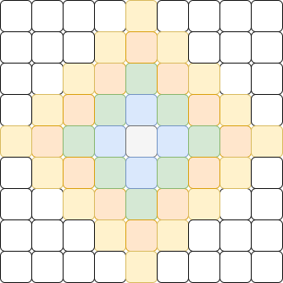
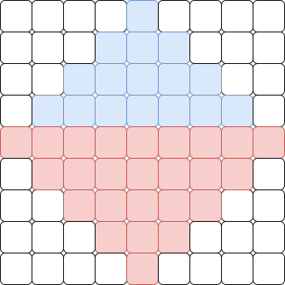
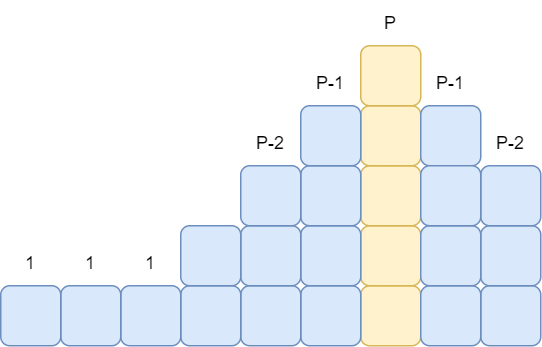

# A. Maquina Panadera Arreglada

Notemos que la figura que se nos va formando del área donde podemos poner la masa es la siguiente. Donde cada color representa un paso distinto.



Entonces, el problema se basa en calcular el área de esa figura en rombo. Veamos que podemos dividir nuestra figura en dos partes similares que son más fáciles de calcular.



Ahora nuestro problema se reduce a calcular el área de dos pirámides. Donde una tiene base $2(P+1) - 1$ y  la otra $2P - 1$. Si vemos la pirámide por niveles, podemos notar que se conforma de los primeros $P$ impares $1, 3, 5, ..., 2P - 1$. Entonces, ahora podemos reducir el problema como calcular la suma de los primeros números impares. Nota que el $i$-esimo numero impar es $2i - 1$. Por lo que, nos queda

$$
\sum_{i = 1}^P (2i - 1) = 2 \sum_{i = 1}^P i - P
$$

Finalmente, podemos calcular la suma desde $1$ hasta $P$ con la fórmula de Gauss y nos queda

$$
2 \sum_{i = 1}^P i - P = 2 \frac{P (P + 1)}{2} - P = P^2
$$

Como es una pirámide de altura $P$ y otra $P+1$ el área simplemente nos queda como $P^2 + (P+1)^2$ y esa es la respuesta que lo podemos hacer en $O(1)$ usando `long long` por los límites del problema.

```cpp
#include <bits/stdc++.h>
using namespace std;

int64_t N;

int main() {
    cin >> N;
    cout << (N+1)*(N+1) + N * N;
    return 0;
}
```

# B. Subsecuencia de Contraseña

Digamos que tenemos el string $S$ conformado por los caracteres $s_1s_2s_3...s_n$ y además la contraseña $P$ conformada de los caracteres $p_1p_2p_3...p_m$. Saber si $P$ es una subsecuencia de $S$ es ver si los caracteres de $P$ aparecen en ese orden dentro de $S$; es decir, debe aparecer primero un $p_1$ luego un $p_2$ y así sucesivamente. 

Nos podemos convencer de que si estamos buscando el carácter $p_1$ nos conviene ver el primer lugar donde aparece en $S$, porque si buscamos después solo estamos desperdiciando posibles caracteres útiles. Entonces para $p_1$ encontramos su primera aparición en $S$, digamos que es $s_k$, ahora debemos encontrar $p_2$ como un carácter en $S$ **que se encuentre después de $s_k$**. Entonces, ahora a partir de $s_k$ buscamos la primera aparición de $p_2$. Y así vamos buscando la cadena y si encontramos todos los caracteres en orden deseado imprimimos que es subsecuencia y no de caso contrario.

En este caso usamos una técnica de **dos punteros** para resolver el problema donde uno avanza en $S$ y otro en $P$ entonces, nuestra complejidad total es $O(|S| + |P|)$.

```cpp
#include <bits/stdc++.h>
using namespace std;

string a, b;
int N, M;

int main() {
    ios_base::sync_with_stdio(0); cin.tie(0);
    cin >> a >> b;

    N = a.size();
    M = b.size();

    for (int i = 0, j = 0; i < M; i++, j++) {
        while (j < N && a[j] != b[i]) j++;
        if (j == N) {
            cout << "No";
            return 0;
        }
    }

    cout << "Si";
    return 0;
}
```

# C. El Amigo Favorito

Para poder resolver el problema, primero intentemos resolver algo más sencillo: **Le puedo dar a mi mejor amigo $P$ dulces?**.

Entonces, supongamos que ya nos dan la cantidad que le quiero dar a mi amigo y solo debo responder si se la puedo dar o no. Para poder responder eso, hay que ver cuál es la mejor configuración posible. En este caso, debemos ver cuántos dulces necesito **mínimo** para poder darle $P$ dulces a mi amigo. Si a mi amigo le doy $P$ dulces y quiero minimizar la cantidad de dulces que quiero dar, entonces a los que están a lado de él, lo mínimo que les puedo dar es $P-1$ y los de al lado de ellos es $P-2$ y así hasta llegar a $1$ porque a todos les debemos de dar 1. Entonces, nos queda algo como lo siguiente.



Podemos usar la Suma de Gauss y checar condiciones para calcular en $O(1)$ la cantidad mínima de dulces que le debo tener para darle a mi amigo $P$. Entonces, podemos resolver esa pregunta de forma eficiente.

Una posible solución seria iterar sobre todos los dulces que le puedo dar a mi amigo (desde $1$ hasta $D$) y dar el máximo que si puedo. Sin embargo, esta es una solución en $O(D)$ lo cual no da en tiempo y menos si el límite es de $20ms$. 

Entonces, nos tenemos que dar cuenta que si le podemos dar $P$ dulces entonces claramente de podemos dar cualquier cantidad entre $1$ y $P$. Por otro lado, si **NO** le podemos dar $P$ dulces entonces no le vamos a poder dar una cantidad mayor. Por lo que, hay un rango en el cual si le podemos dar dulces y un punto el cual a partir de allí ya no le podemos dar. Esto cumple las propiedades para poder hacer una búsqueda binaria, encontrar la primera cantidad de dulces que **NO** podemos dar. Y el máximo que si podemos dar seria eso menos 1.

Como que hace una búsqueda binaria que respondemos en constante, nos da una complejidad de $O(\log D)$.

```cpp
#include <bits/stdc++.h>
using namespace std;

int64_t N, D, K;

int64_t Gauss(int64_t x) {return x * (x + 1) / 2;}

bool puedo_dar(int64_t P) {
    int64_t amigos_izquierda = K - 1,
            amigos_derecha   = N - K,
            dulces_izquierda,
            dulces_derecha,
            dulces_total;
    
    dulces_izquierda = (amigos_izquierda >= P - 1) ? 
        (Gauss(P-1) + amigos_izquierda - (P - 1)) : (Gauss(P-1) - Gauss(P - 1 - amigos_izquierda));
    dulces_derecha   = (amigos_derecha >= P - 1)   ? 
        (Gauss(P-1) + amigos_derecha - (P - 1))   : (Gauss(P-1) - Gauss(P - 1 - amigos_derecha));
    dulces_total = dulces_izquierda + P + dulces_derecha;
    
    return dulces_total <= D;
}

int main() {
    ios_base::sync_with_stdio(0); cin.tie(0);
    cin >> N >> D >> K;

    int ini = 0, fin = D + 1;
    while (ini != fin) {
        int mit = (ini + fin) / 2;
        if (puedo_dar(mit))
            ini = mit + 1;
        else
            fin = mit;
    }
    cout << ini - 1;
    return 0;
}
```

# D. Arte de Leonardo

Como cada color es pintando en un intervalo, lo primero que debemos notar es que cada color justamente nos define un rango, desde la primera vez que aparece hasta la última. Es decir, si el color $2$ aparece por primera vez en la posición $1$ y por última vez en la posición $7$. Esto quiere decir que el intervalo $[2, 7]$ es el intervalo del $2$. Además, todo lo que se encuentre dentro de este intervalo, debe estar contenido. Es decir, no puede pasar que el $2$ tenga el intervalo $[2, 7]$ y el $3$ el $[4, 10]$ porque uno habría traslapado al otro. Entonces, podíamos ver cada color con un paréntesis que abre y un paréntesis que cierra. Guardando su primera y última aparición en una cubeta.


Entonces, ver si el arreglo de una configuración valida era lo mismo que resolver el problema [Paréntesis Balanceados](https://omegaup.com/arena/problem/Parentesis-Balanceados/) de la Tarea de Estructura de Datos. Lo cual puede ser resuelto usando una pila y viendo si el ultimo paréntesis que inserte coincide con el que tengo ahora si es uno que cierra o meterlo a la pila si es uno que abre.

Luego, para responder la cantidad mínima de tiempo usada por el artista, lo podíamos ver con la concatenación de paréntesis más profunda. Podemos definir la profundidad de unos paréntesis como *dentro de cuantos paréntesis estoy* y la mayor profundidad era nuestra respuesta. Esto, es porque cada profundidad nos obliga hacer un paso del pintado como en la figura, que el verde este dentro del azul y el amarrillo implica que primero se debieron pintar esos dos. Además, como se pueden hacer varios intervalos sin intersección de una pasada, solo te interesaba el de mayor profundidad, porque los demás los puedes hacer de forma simultánea. Para calcular la profundidad solo bastaba ver el tamaño de pila cuando insertabamos los paréntesis.Solo había que tener cuidado porque el $0$ era un caso especial, pero podíamos poner un $0$ al inicio y final del arreglo para tratarlo como otro color y le restábamos uno a la profundidad.

La solución es recorrer el arreglo haciendo operaciones en una pila $O(1)$ y preguntando en una cubeta $O(1)$; por lo que la complejidad total es de $O(N)$.

```cpp
#include <bits/stdc++.h>
using namespace std;

int N, res, fin = 0;
vector<int> vec, pila;
vector<pair<int, int>> limites;

// -------- Funciones Pila ------------- //
void push(int x) { pila[fin++] = x; }
int sz() { return fin; }
int top() { return pila[fin-1]; }
void pop() { pila[--fin] = 0; }
// -------- Funciones Pila ------------- //

int main() {
    int N;
    cin >> N;
    
    vec.resize(N + 2);
    pila.resize(N + 2);
    limites.resize(N + 1, {N+1, 0});

    for (int i = 1; i <= N; i++) {
        cin >> vec[i];
        int color = vec[i];
        limites[color].first  = min(limites[color].first,  i);
        limites[color].second = max(limites[color].second, i);
    }

    vec[0] = vec[N+1] = 0;
    limites[0] = {0, N+1};

    for (int i = 0; i <= N+1; i++) {
        int color = vec[i];

        if (i == limites[color].first) {
            push(color);
            res = max(res, sz());
        }

        if (top() != color) {
            cout << -1 << "\n";
            return 0;
        }

        if (i == limites[color].second)
            pop();
    }

    cout << res - 1 << "\n";
    return 0;
}
```